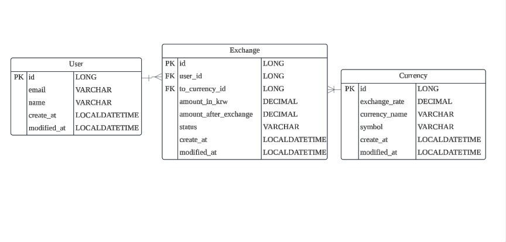

# 환율 API명세서

# API 명세서

| **기능** | **Method** | **Url** | **상태코드** |
| --- | --- | --- | --- |
| 환전 요청  | POST | /api/exchanges | 200: 정상조회
404: 존재하지 않는 경우 |
| 환전 요청 조회 | GET | /api/exchanges/users/{userId} | 200: 정상조회 |
| 환전 취소 | UPDATE | /api/exchanges/{id} | 200: 정상조회
404: 존재하지 않는 경우 |
| 고객 정보 삭제 | DELETE | /api/users/users/{userId} | 200: 정상조회
404: 존재하지 않는 경우 |

# **환전 요청**

요청된 환전을 수행합니다

| **메서드** | **요청 URL** |
| --- | --- |
| POST | http://{SERVER_URL}/exchanges |

### **Request**

| **메소드** | **타입** | **설명** |
| --- | --- | --- |
| id | Long | 고객 고유 식별자 |
| amountIntKrw | BigDecimal | 환전 전 금액 |
| currencyId | Long | 통화 고유 식별자 |

예시

```jsx
{
    "userId": 1,
    "amountInKrw": 10000    
}
```

### **Response**

| **메소드** | **타입** | **설명** |
| --- | --- | --- |
| id | Long | 환전요청 고유 식별자 |
| amountAfterExchange | BigDecimal | 환전 후 금액 |
| status | String | 상태 |

예시

```jsx
{
    "id": 1,
    "exchange": 11.11,
    "status": "normal"
}
```

# **환전 요청 조회**

특정 고객이 수행한 환전 요청을 조회합니다

| **메서드** | **요청 URL** |
| --- | --- |
| GET | http://{SERVER_URL}/exchanges/users/{userId} |

### **Request**

없음

### **Response**

| **메소드** | **타입** | **설명** |
| --- | --- | --- |
| id | Long | 환전요청 고유 식별자 |
| amountAfterExchange | BigDecimal | 환전 후 금액 |
| status | String | 상태 |

예시

```jsx
{
    "id": 1,
    "exchange": 11.11,
    "status": "normal"
}
```

# **환전 요청 상태 변경**

환전 요청 상태를 취소로 변경합니다

| **메서드** | **요청 URL** |
| --- | --- |
| UPDATE | http://{SERVER_URL}/exchanges/{id} |

### **Request**

없음

### **Response**

| **메소드** | **타입** | **설명** |
| --- | --- | --- |
| id | Long | 환전요청 고유 식별자 |
| amountAfterExchange | BigDecimal | 환전 후 금액 |
| status | String | 상태 |

예시

```jsx
{
    "id": 1,
    "exchange": 11.11,
    "status": "cancelled"
}
```

# **고객 정보 삭제**

고객 정보를 삭제합니다

삭제할때 해달 고객이 수행한 모든 환전 요청도 삭제합니다

| **메서드** | **요청 URL** |
| --- | --- |
| DELETE | http://{SERVER_URL}/exchanges/users/{userId} |

### **Request**

없음

### **Response**

정상적으로 삭제되었습니다.

# **ERD**
